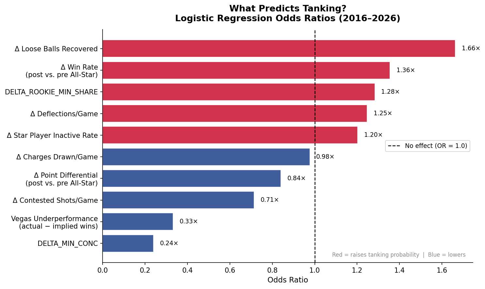
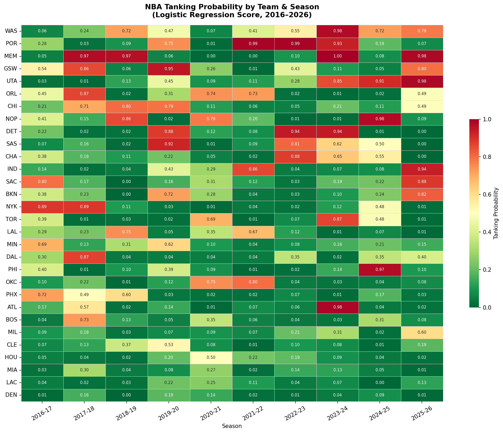
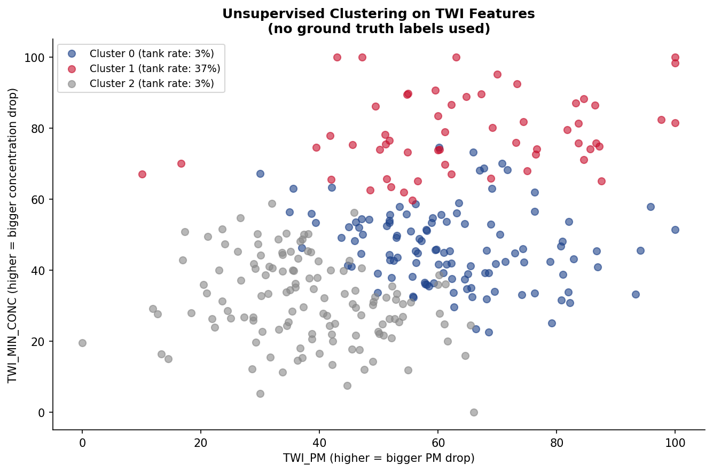

# NBA Tanking Watch Index

Statistical detection of intentional tanking in the NBA, built for MIT [15.285 Sports Strategy](https://entrepreneurship.mit.edu/) (Spring 2026). The project asks a question relevant to the league office: **can on-court and roster-deployment data distinguish a team that is *trying to lose* from a team that is simply bad?**

Rather than relying on win totals alone (which can't separate intent from incompetence), the project builds team-season features around the **All-Star break** — the point in the season when teams with no playoff hopes typically begin resting/shutting down veterans and playing younger players — and tests whether the *change* in effort, performance, and roster usage after the break predicts tanking better than record alone.

## Key question

> Can we statistically distinguish intentional tanking from legitimate losing using publicly available data?

## Approach

1. **Data collection** (`nba_api`) — team game logs, hustle stats (deflections, contested shots, loose balls, charges drawn), standings, roster age, and individual player availability, for every team across **10 seasons (2016‑17 through 2025‑26)**, split into pre‑/post‑All‑Star‑break windows.
2. **Ground truth labels** — a hand-coded set of known tanking team-seasons (e.g., Philadelphia's "Process," post-trade rebuild years in Houston/OKC/Detroit/San Antonio/Utah/Washington) based on public front-office statements, documented veteran teardowns, media consensus, and historically extreme losing.
3. **Vegas preseason win totals** (sourced from Covers.com's NBA odds history) — used to compute **underperformance** = actual wins − Vegas-implied wins, a market-based expectation baseline independent of the model's own features.
4. **Feature engineering** — pre/post All-Star deltas in:
   - Point differential and win rate
   - Hustle stats (deflections, contested shots, loose balls recovered, charges drawn)
   - Minutes concentration among top players (`DELTA_MIN_CONC`)
   - Rookie/young-player minutes share (`DELTA_ROOKIE_MIN_SHARE`)
   - Star player inactive ("rest") rate, isolated from "Injury/Illness" absences (`DELTA_INACTIVE_RATE`)
5. **Three modeling/scoring approaches**, built up across the notebooks:
   - **Logistic regression** — interpretable odds ratios for each feature (audience: league office memo)
   - **Tanking Watch Index (TWI)** — a composite 0–100 score (`RobustScaler`-normalized, outlier-clipped) combining point-differential drop, minutes-concentration drop, rookie-minutes increase, and inactive-rate increase, with a weight-sensitivity analysis across alternative weighting schemes
   - **Tanking Severity Index (TSI)** — a simpler two-component severity score (win-rate decline + point-differential decline)
   - **K-means clustering** (unsupervised, no ground truth used) — recovers a high-risk cluster with a **37% ground-truth tank rate**, vs. ~3% in the other two clusters
6. **Visualization & case studies** for known tanking franchises (PHI, OKC, UTA, DET, NOP, WAS) plus league-wide trend charts (e.g., blowout-rate-by-season, which hit a record 34% in April 2026).

## Sample results

| Odds ratios (logistic regression) | Tanking probability heatmap |
|---|---|
|  |  |

The strongest single predictor of tanking is a **drop in loose balls recovered per game** post-All-Star (OR ≈ 1.66×), followed by win-rate decline, rising rookie minutes share, and declining deflections — effort and roster-usage signals outperform raw record changes. Vegas preseason underperformance and minutes concentration changes are associated with *lower* odds of the tanking label, consistent with the two-part label design (bottom-8 record + declining win rate) screening out teams that simply got worse without changing how they deploy players.

Unsupervised clustering on the TWI components, with no ground-truth labels involved, independently recovers a cluster of team-seasons with a tanking rate roughly 10x higher than the rest of the league:



## Repository structure

```
.
├── NBA_tanking_metric.ipynb        # Full pipeline: data collection → ground truth +
│                                    # Vegas labels → features → logistic regression →
│                                    # TWI/TSI indices → clustering → charts
├── NBA Tanking Memo + Technical Appendix.pdf            # Write-up for a league-office
│                                                          # audience, summarizing findings
├── NBA Tanking Memo + Technical Appendix (with code).pdf # Same memo with the supporting
│                                                          # code included
├── requirements.txt
├── hustle_data/                    # Cached pre/post All-Star hustle-stat features
├── player_availability/            # Cached pre/post All-Star player availability features
│                                    # by season (2016-17 through 2025-26)
├── outputs/                        # All generated figures, scores, and intermediate/
│                                    # final CSVs (game logs, standings, model results,
│                                    # TWI/TSI scores, cluster assignments)
└── NBA_tanking_hot_take_video.mp4   # Short video summary (not tracked in git — see below)
```

## Getting started

```bash
pip install -r requirements.txt
```

Open `NBA_tanking_metric.ipynb` in Jupyter and run top to bottom. The first run will hit `nba_api` for all 10 seasons (rate-limited, so expect it to take a while); cached intermediate features are written to `outputs/`, `hustle_data/`, and `player_availability/` so subsequent analysis cells don't require re-fetching.

All figures and result tables are written to `outputs/`.

## Data sources

- **[nba_api](https://github.com/swar/nba_api)** — official NBA Stats endpoints (game logs, hustle stats, standings, roster/team stats, player availability)
- **Covers.com Sports Odds History** — Vegas preseason win totals, hand-entered into the notebook for the underperformance feature

## Note on the video

`NBA_tanking_hot_take_video.mp4` (~227MB) is excluded from version control via `.gitignore` because it exceeds GitHub's 100MB per-file limit. It's available locally in this directory.

## License

MIT — see [LICENSE](LICENSE).
